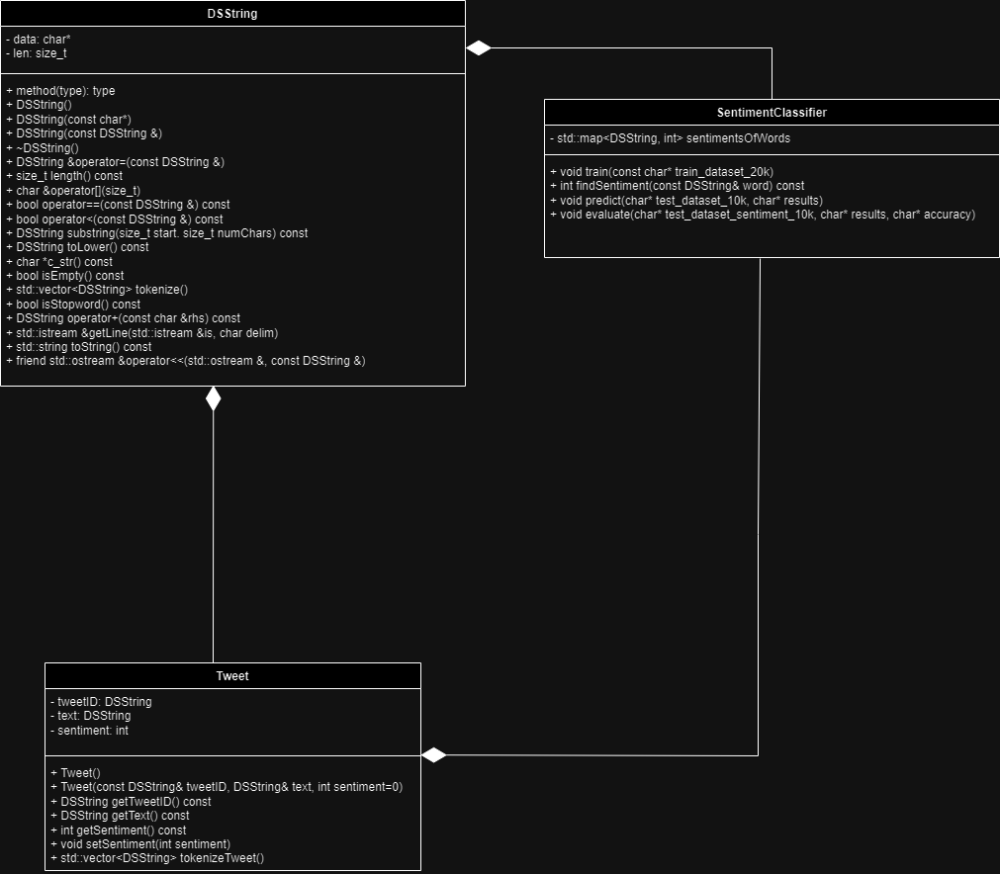

# Assignment 2: Answers

**Complete this document, commit your changes to Github and submit the repository URL to Canvas.** Keep your answers short and precise.

Your Name: Aaron Santa Cruz

Used free extension: [ ] 24 hrs or [ ] 48 hrs

[] Early submission (48 hrs)

[x] Bonus work. Describe: I implemented a stopword function into my tokenization process to ignore common stopwords.

Place [x] for what applies.

## UML Diagram

Add your UML class diagram here.

Replace the following image with your diagram. You can draw it by hand and take a photo.

## Answers

1. How do you train the model and how do you classify a new tweet? Give a short description of the main steps.

    > The approach I took to training my Sentiment Classifier was centered around the use of a map. My sentimentOfWords map was composed of a DSString word key and an int sentiment value. To populate my map with the correct words and corresponding sentiments, I first tokenized the tweets in the training data set. I then added each word to my map and either incremented or decremented by 1, depending on what the given sentiment of the tweet was. After I did this for all my tweets, I effectively obtained a map that could be used to classify tweets, where I could look up individual words in a tweet and find the sum of the individual sentiments to determine the overall sentiment of the tweet.

2. How long did your code take for training and what is the time complexity of your training implementation (Big-Oh notation)? Remember that training includes reading the tweets, breaking it into words, counting, ... Explain why you get this complexity (e.g., what does `N` stand for and how do your data structures/algorithms affect the complexity).

   > The training algorithm is O(L*C*W^2*log(N)). Reading each line from the file takes O(L), where L is the number of lines. I tokenize all of those characters, O(C), and also check whether or not the tokenized words are stopwords, O(W). Lastly, I put O(W) words into my map and update the sentiment of the word,log(N). Multiplying these all together yields O(L*C*W^2*log(N)). My run time for the training algorithm was 1.95406 seconds.

3. How long did your code take for classification and what is the time complexity of your classification implementation (Big-Oh notation)? Explain why.

   > The classification algorithm is also O(L*C*W^2*log(N)). Reading and writing each line from the file takes O(L), where L is the number of lines. I tokenize all of those characters, O(C), and also check whether or not the tokenized words are stopwords, O(W). Lastly, I find and sum the sentiment of O(W) words in my map, where finding the sentiment of each word takes log(N). Multiplying these all together yields O(L*C*W^2*log(N)). My run time for the classification algorithm was 1.17922 seconds. 

4. What accuracy did your algorithm achieve on the provides training and test data? 

   > My accuracy: 66.9%

   The TA will run your code on Linux and that accuracy value will be used to determine your grade.

5. What were the changes that you made that improved the accuracy the most?
   
   > Initially, my accuracy was around 57% by implementing my map successfully. A big change that helped my accuracy was a stopword function. My stopword function checked if a particular token was a stopword (her, him, our, etc) and was used to ignore them in the tokenziation process. In doing so, my accuracy shot up close to around 10 percentage points. 

6. How do you know that you use proper memory management? I.e., how do you know that you do not have
   a memory leak?

   > I used valgrind to test my sentiment and test_DSString executables and found that all allocations were freed from the heap.

6. What was the most challenging part of the assignment?

   > The most challenging aspect of this assignment was finding a way around utilizing strings. For example, I remember my first instinct was to read the lines from files as strings and convert them to DSStrings. However, I had to find a way around using the string library. I created my own custom getLine function and called it on a DSString object. File handling was tricky, especially with larger data sets than I was used to. Keeping track of what was being read, outputted, and written required a lot of thought. Additionally, the debugging process was tedious. I always found myself spending time with the edge cases and trying to figure work my way backwards from there to identify the problem.