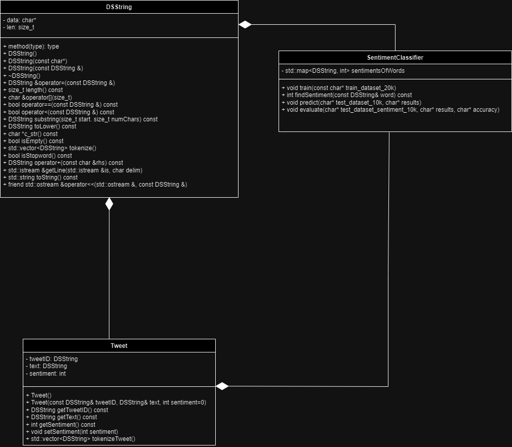

**Objectives:** 

* Implement a class (DSString) that uses dynamic memory allocation to create strings
* Parse a large data set of tweets into DSStrings and tokenize meaningful words
* Use training data to train a sentiment classifier
* Use sentiment classifier identify the sentiments of tweets
* Calculate the accuracy of classifier and identify incorrectly classified tweets
* Implement strategies to improve classification (i.e. stopwords, stemming, etc.)

**Learning Objectives**
* Practice debugging and memory leak detection.
* Use of STL container (vectors, maps, etc.)
* Analyze the runtime complexity.
* Design, implement, and test a small system.

## The Data
The original data was retrieved from Kaggle at https://www.kaggle.com/kazanova/sentiment140.
For more information, see  Go, A., Bhayani, R. and Huang, L., 2009. Twitter sentiment classification using distant supervision. CS224N Project Report, Stanford, 1(2009), p.12.

The training data file is formatted as a comma-separated-values (CSV) file containing a list of tweets, each one on a separate line.  Each line of the data files include the following fields:
* Sentiment value (negative = 0, positive = 4, numbers in between are not used),
* the tweet id,
* the date the tweet was posted
* Query status (you can ignore this column)
* the twitter username that posted the tweet
* the text of the tweet itself

The testing data set is broken into two files:
* A CSV file containing formatted just like the training data EXCEPT no Sentiment column
* A CSV file containing tweet ID and sentiment for the testing dataset (so you can compare your predictions of sentiment to the actually sentiment ground truth)


## Running your Program: Training and Testing
The program takes 5 cmd line arguements
1. training data set filename - the file with the training tweets
2. testing data set filename - tweets that your program will classify
3. testing data set sentiment filename - the file with the classifications for the testing tweet data
4. classifier results file name - see Output Files section below
5. classifier accuracy and errors file name - see Output Files section below

Example: In the build folder executing this command in the terminal should work.
```
./sentiment data/train_dataset_20k.csv data/test_dataset_10k.csv data/test_dataset_sentiment_10k.csv results.csv accuracy.txt
```


### Output Files
Program produces two output files. The first output file has the classifier's
results for all tweets in the testing dataset in the same format as the sentiment file:
```
4, 1467811596
...
```

The second file has the accuracy of the classifier. The remaining lines contain information related to which tweets the algorithm incorrectly classified, the ground turth, and the Tweet ID

Example of the testing data tweet classifications file:
```
0.500
4, 1, 2323232323
1, 3, 1132553423
...
```

## UML Diagram



## Answers

1. How do you train the model and how do you classify a new tweet?

    > The approach I took to training my Sentiment Classifier was centered around the use of a map. My sentimentOfWords map was composed of a DSString word key and an int sentiment value. To populate my map with the correct words and corresponding sentiments, I first tokenized the tweets in the training data set. I then added each word to my map and either incremented or decremented by 1, depending on what the given sentiment of the tweet was. After I did this for all my tweets, I effectively obtained a map that could be used to classify tweets, where I could look up individual words in a tweet and find the sum of the individual sentiments to determine the overall sentiment of the tweet.

2. How long did your code take for training and what is the time complexity of your training implementation (Big-Oh notation)? Remember that training includes reading the tweets, breaking it into words, and counting.
   > The training algorithm is O(L*C*W^2*log(N)). Reading each line from the file takes O(L), where L is the number of lines. I tokenize all of those characters, O(C), and also check whether or not the tokenized words are stopwords, O(W). Lastly, I put O(W) words into my map and update the sentiment of the word,log(N). Multiplying these all together yields O(L*C*W^2*log(N)). My run time for the training algorithm was 1.95406 seconds.

3. How long did your code take for classification and what is the time complexity of your classification implementation (Big-Oh notation)? Explain why.

   > The classification algorithm is also O(L*C*W^2*log(N)). Reading and writing each line from the file takes O(L), where L is the number of lines. I tokenize all of those characters, O(C), and also check whether or not the tokenized words are stopwords, O(W). Lastly, I find and sum the sentiment of O(W) words in my map, where finding the sentiment of each word takes log(N). Multiplying these all together yields O(L*C*W^2*log(N)). My run time for the classification algorithm was 1.17922 seconds. 

4. What accuracy did your algorithm achieve on the provides training and test data? 

   > My accuracy: 66.9%

   The TA will run your code on Linux and that accuracy value will be used to determine your grade.

5. What were the changes that you made that improved the accuracy the most?
   
   > Initially, my accuracy was around 57% by implementing my map successfully. A big change that helped my accuracy was a stopword function. My stopword function checked if a particular token was a stopword (her, him, our, etc) and was used to ignore them in the tokenziation process. In doing so, my accuracy shot up close to around 10 percentage points. 

6. How do you know that you use proper memory management? I.e., how do you know that you do not have
   a memory leak?

   > I used valgrind to test my sentiment and test_DSString executables and found that all allocations were freed from the heap.

6. What was the most challenging part of the assignment?

   > The most challenging aspect of this assignment was finding a way around utilizing strings. For example, I remember my first instinct was to read the lines from files as strings and convert them to DSStrings. However, I had to find a way around using the string library. I created my own custom getLine function to read individual characters. File handling was tricky, especially with a somewhat sizeable dataset. Keeping track of what was being read, outputted, and written required close attention. I always found myself spending time with the edge cases and trying to work my way backwards from there to identify the problem.